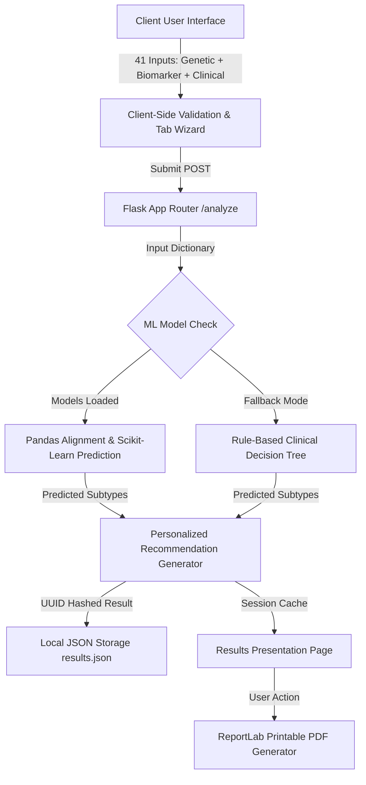

# MindGen AI - Technical & Strategic Project Documentation

## 1. Project Overview & Clinical Focus
**MindGen AI** is an advanced AI-powered mental health assessment and personalization platform. It integrates genetic datasets (SNPs), laboratory biomarkers, and clinical self-report questionnaires (PHQ-9 and GAD-7) to:
- Predict susceptibility to major mental health conditions (Depression, Bipolar Disorder, and Anxiety).
- Classify these conditions into specific clinical subtypes (e.g., Seasonal Affective Disorder, BD-I, Panic Disorder).
- Compile a personalized, multi-dimensional care path including nutritional, lifestyle, and therapeutic interventions.

---

## 2. System Architecture & Pipeline Flow
The application follows a clean, modular pipeline spanning the client UI, validation layer, processing engine, and presentation layers:

### Assessment Processing Steps:
1. **User Submission:** The user fills out 41 distinct genetic, biochemical, and clinical parameters via an interactive tabbed wizard.
2. **Formatting & Alignment:** The Flask route captures the data and parses it. If machine learning models are active, the features are structured into a Pandas DataFrame and column-aligned to match the training data layout exactly, preventing feature-mismatch prediction bugs.
3. **Inference / Fallback:** 
   - **Machine Learning Mode:** Scikit-learn dummy/trained models predict diagnosis codes, which are mapped back to labels via encoders.
   - **Rule-Based Fallback Mode:** In environments without compiled scientific modules (like local Python 3.14 setups), a deterministic clinical decision engine infers risk levels based on PHQ-9 (depression severity) and GAD-7 (anxiety severity) threshold rules.
4. **Treatment Plan Construction:** The predictions are passed to a clinical recommendation matrix (`recommended_path`), generating lifestyle, pharmacotherapeutic warning thresholds, dietary, and counseling steps.
5. **Persistence:** The results, timestamps, and patient metadata are persisted to local JSON databases.

---

## 3. Technology Stack & Data Storage

### Data Storage & Databases
- **User Credentials Store (`users.json`):** A lightweight JSON-based document store. User passwords and security recovery questions are hashed using **bcrypt** salt rounds to enforce local security and privacy.
- **Assessment History (`results.json`):** Relates unique assessment UUIDs to usernames, timestamps, diagnostic subtypes, and the compiled care paths.

### Backend Application
- **Language:** Python (optimized for 3.14 compatibility via fallback modes).
- **Core Framework:** Flask (handles routing, session tracking, and templating).
- **Security:** `bcrypt` for cryptographic hashes.
- **Reporting Engine:** `ReportLab` (generates custom Letter/A4 clinical reports with margins, headers, grids, and disclaimer footer).

### Frontend Interface
- **Layout & Design:** Vanilla CSS with custom property systems (midnight theme, glassmorphic panels, neon state indicators).
- **Interactions & UX:** 
  - **GreenSock Animation Platform (GSAP):** Triggers page entry transitions, dashboard stagger load-ins, and widget slide-ins.
  - **Wizard Focus Controller:** A custom JS event driver capturing keydown actions on input fields. Pressing **Enter** automatically shifts cursor focus to the next field or tab pane, optimizing the questionnaire flow.
  - **AI Mentor Chatbot Widget:** A client-side chatbot providing patient support, explaining biochemical markers, genetic SNPs, and PDF handling instructions.

---

## 4. Referenced Datasets & Clinical Metrics
MindGen AI maps inputs against established clinical and biological indicators:
- **PHQ-9 (Patient Health Questionnaire):** A 9-item scale measuring depression severity (0-4: Minimal, 5-9: Mild, 10-14: Moderate, 15-19: Moderately Severe, 20-27: Severe).
- **GAD-7 (Generalized Anxiety Disorder):** A 7-item scale mapping anxiety risk levels (0-4: Minimal, 5-9: Mild, 10-14: Moderate, 15-21: Severe).
- **Genetic Variants (SNPs):** 
  - *5-HTTLPR* (Serotonin-transporter-linked polymorphic region)
  - *COMT* (Val158Met dopamine metabolism pathway)
  - *MAOA* (Monoamine Oxidase A neurotransmitter clearance)
  - *MTHFR* (C677T folic-acid metabolism)
  - *ANK3 / CACNA1C / ODZ4* (Calcium-channel regulating variants associated with bipolar cycling)
- **Biomarkers:** Serum Cortisol levels (stress response), BDNF (neurogenesis), Inflammatory cytokines (IL-6, TNF-alpha), and neurotransmitter precursors (Tryptophan).

---

## 5. Future Market Scope & Roadmap
To scale MindGen AI into a commercial clinical grade software:
1. **HIPAA & GDPR Compliance:** Refactor the storage layer to utilize encrypted PostgreSQL or AWS RDS with column-level encryption, integrating JWT authentication and full audit trails.
2. **EHR / EMR Integration:** Implement HL7 FHIR (Fast Healthcare Interoperability Resources) APIs to pull lab biomarker results directly from medical providers (e.g., Quest Diagnostics, Labcorp) and export reports back to patient charts.
3. **FDA Software as a Medical Device (SaMD) Clearence:** Refine the predictive models, conduct clinical trials to substantiate accuracy metrics, and submit under the FDA 510(k) premarket notification pathway.
4. **Wearable Sensor Integration:** Hook into Apple HealthKit, Fitbit, or Garmin API to pull live physical activity levels, heart rate variability (HRV), and sleep duration metrics, replacing manual self-reporting.
5. **Expanded Pharmacogenomics:** Align predictions with drug-gene interaction databases (like CPIC guidelines) to caution patients on potential pharmaceutical side effects based on their COMT or CYP450 variants.
